# Adorn API Cross-References and Relationships

This document provides comprehensive cross-references between related APIs, showing how different components work together in the Adorn API ecosystem.

## Table of Contents

1. [Core API Relationships](#core-api-relationships)
2. [Decorator and Route Relationships](#decorator-and-route-relationships)
3. [Response and Reply Relationships](#response-and-reply-relationships)
4. [Error Handling Relationships](#error-handling-relationships)
5. [Validation and Schema Relationships](#validation-and-schema-relationships)
6. [OpenAPI and Documentation Relationships](#openapi-and-documentation-relationships)
7. [Integration API Relationships](#integration-api-relationships)

## Core API Relationships

### Route Definition and Registration

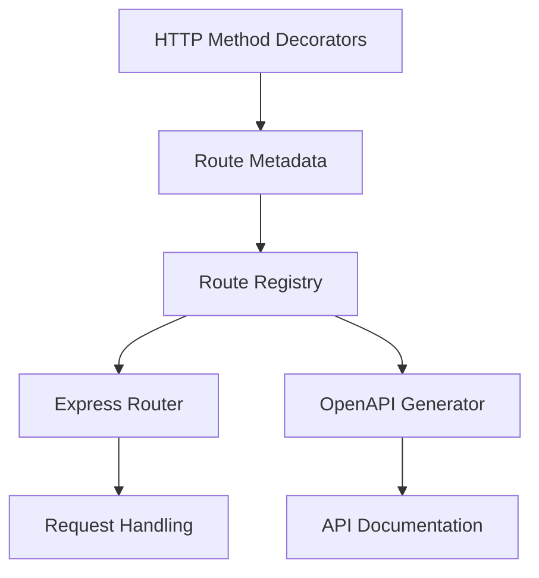

**Key Components:**
- `@Get()`, `@Post()`, `@Put()`, `@Patch()`, `@Delete()` - Define routes on controller methods
- `RouteMeta` - Stores route metadata (method, path, options)
- `RouteEntry` - Complete route information in registry
- `Registry` - Central collection of all routes and controllers
- `buildRegistry()` - Creates registry from controllers
- `applyRegistryToExpressRouter()` - Applies routes to Express
- `buildOpenApi()` - Generates OpenAPI from registry

**Usage Flow:**
```typescript
// 1. Define routes with decorators
@Controller('/users')
class UserController {
  @Get('/:id')
  async getUser(id: string) {}
}

// 2. Build registry
const registry = buildRegistry([UserController]);

// 3. Use registry for Express
const router = express.Router();
applyRegistryToExpressRouter(router, registry);

// 4. Use registry for OpenAPI
const openApiDoc = buildOpenApi(registry, { title: 'My API', version: '1.0.0' });
```

### Request Processing Pipeline

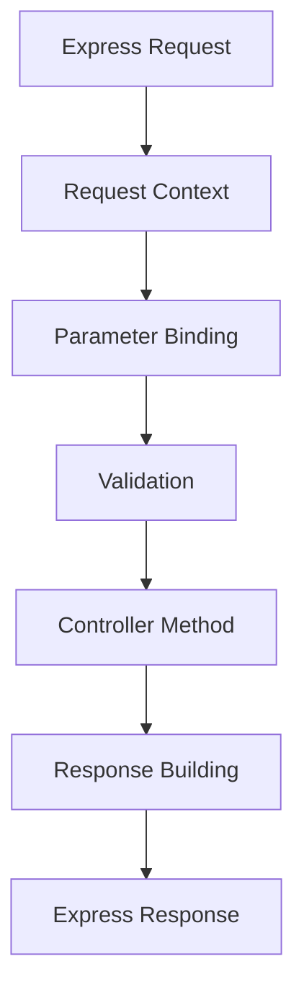

**Key Components:**
- `RequestContext` - Contains request data and context
- `bindArgs()` - Binds parameters to handler arguments
- `Validator` interface - Validates request data
- Controller methods - Business logic
- `reply()`, `noContent()` - Build responses
- `Reply` type - Typed response objects

**Usage Flow:**
```typescript
// 1. Request comes in
app.use('/api', router);

// 2. Parameter binding
const { args } = bindArgs(route, handler, requestContext);

// 3. Validation
const validationResult = await validator.validate(args);

// 4. Controller execution
const result = await handler(...args);

// 5. Response building
if (isReply(result)) {
  res.status(result.status).json(result.body);
}
```

## Decorator and Route Relationships

### Decorator Hierarchy

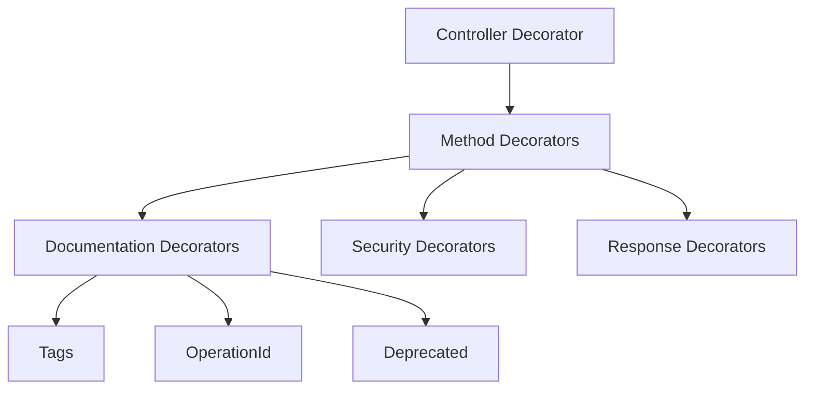

**Key Relationships:**
- `@Controller()` - Defines controller class with base path
- `@Get()`, `@Post()`, etc. - Define routes on methods
- `@Tags()` - Adds OpenAPI tags to routes
- `@OperationId()` - Sets unique operation ID
- `@Deprecated()` - Marks route as deprecated
- `@Responses()` - Defines response specifications
- `@Security()` - Sets security requirements

**Example:**
```typescript
@Controller('/users', {
  security: [{ bearerAuth: [] }]
})
@Tags('Users', 'API')
class UserController {
  @Get('/:id')
  @OperationId('getUserById')
  @Responses({
    200: { description: 'User found' },
    404: { description: 'User not found' }
  })
  async getUser(id: string) {}
}
```

### Route Configuration Inheritance

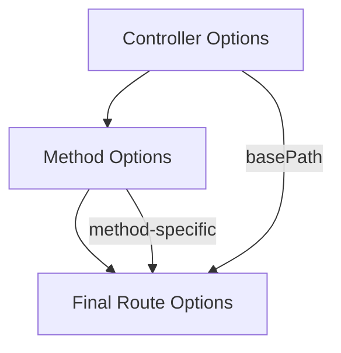

**Inheritance Rules:**
1. Controller `basePath` prefixes all route paths
2. Controller-level options apply to all methods
3. Method-level options override controller options
4. Decorator options merge with method options

**Example:**
```typescript
@Controller('/api/v1/users', {
  security: [{ bearerAuth: [] }],
  tags: ['Users']
})
class UserController {
  // Inherits security and tags from controller
  @Get('/:id', {
    summary: 'Get user by ID' // Adds to inherited options
  })
  async getUser(id: string) {}
}
```

## Response and Reply Relationships

### Response Type Hierarchy

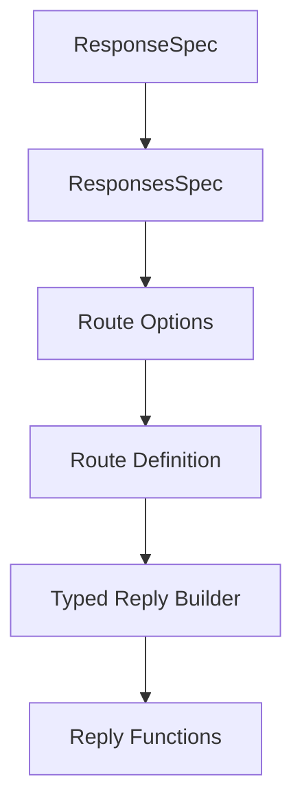

**Key Components:**
- `ResponseSpec` - Single response specification
- `ResponsesSpec` - Collection of responses by status code
- `RouteOptions` - Contains responses configuration
- `defineRoute()` - Creates route with responses
- `makeReply()` - Creates typed reply builder
- `reply()`, `noContent()` - Response functions

**Usage Flow:**
```typescript
// 1. Define responses
const userRoute = defineRoute('/users/:id', {
  responses: {
    200: { description: 'User found', content: { 'application/json': { schema: userSchema } } },
    404: { description: 'User not found' }
  }
});

// 2. Get typed reply builder
const reply = userRoute.reply;

// 3. Use typed responses
reply(200, user); // Type-safe!
reply(404, { error: 'Not found' }); // Type-safe!
```

### Response Building Patterns

```mermaid
graph TD
    A[Basic Reply] --> B[Typed Reply]
    B --> C[Route-Specific Reply]
    A -->|reply()| D[Reply Object]
    B -->|makeReply()| E[Typed Reply Builder]
    C -->|route.reply()| F[Route-Specific Reply]
```

**Pattern Comparison:**

```typescript
// Basic reply (untyped)
return reply(200, user);

// Typed reply (schema-based)
const typedReply = makeReply({
  200: { content: { 'application/json': { schema: userSchema } } }
});
typedReply.reply(200, user); // Type-safe!

// Route-specific reply (most type-safe)
const userRoute = defineRoute('/users/:id', {
  responses: {
    200: { content: { 'application/json': { schema: userSchema } } },
    404: { content: { 'application/json': { schema: errorSchema } } }
  }
});
userRoute.reply(200, user); // Most type-safe!
userRoute.reply(404, { error: 'Not found' }); // Most type-safe!
```

## Error Handling Relationships

### Error Type Hierarchy

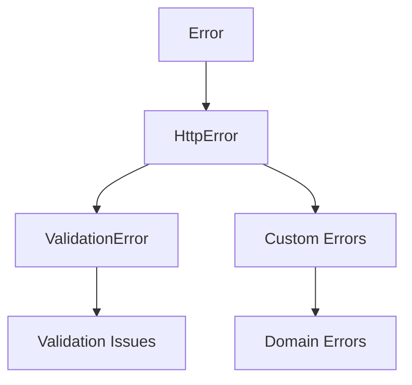

**Key Components:**
- `Error` - Base JavaScript error
- `HttpError` - HTTP error with status code
- `ValidationError` - Validation-specific error
- Custom errors - Domain-specific errors

**Usage Patterns:**
```typescript
// Basic HttpError
throw new HttpError(404, 'User not found', {
  code: 'USER_NOT_FOUND',
  details: { id: '123' }
});

// ValidationError
throw ValidationError.fromIssues([
  { path: ['body', 'email'], message: 'Invalid email format' }
]);

// Custom domain error
class UserNotFoundError extends HttpError {
  constructor(userId: string) {
    super(404, 'User not found', {
      code: 'USER_NOT_FOUND',
      details: { userId }
    });
  }
}
```

### Error Handling Flow

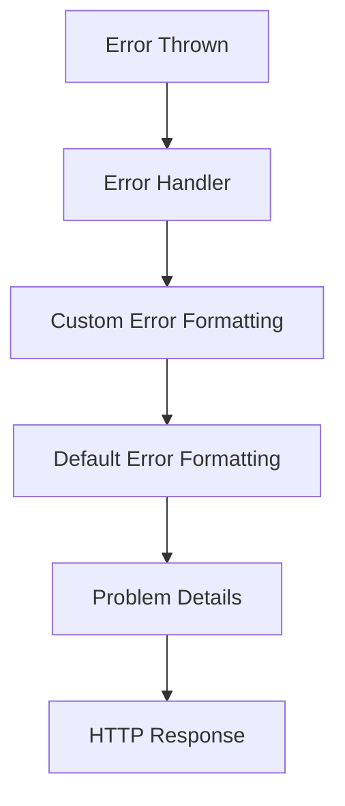

**Key Components:**
- `adornErrorHandler` - Default error handler
- `createAdornExpressErrorHandler` - Customizable handler
- `AdornErrorHandlerOptions` - Customization options
- `toProblemDetails()` - Converts errors to Problem Details
- `ProblemDetails` - RFC 7807 problem details format

**Usage Flow:**
```typescript
// 1. Configure error handler
const errorHandler = createAdornExpressErrorHandler({
  onError: (err, ctx) => {
    // Custom error formatting
    if (err instanceof ValidationError) {
      return {
        status: 400,
        body: {
          success: false,
          errors: err.issues
        }
      };
    }
    return ctx.defaultProblem; // Use default for other errors
  }
});

// 2. Use error handler
app.use(errorHandler);

// 3. Errors are automatically handled
throw new HttpError(404, 'User not found'); // -> 404 response
```

## Validation and Schema Relationships

### Schema Type Hierarchy

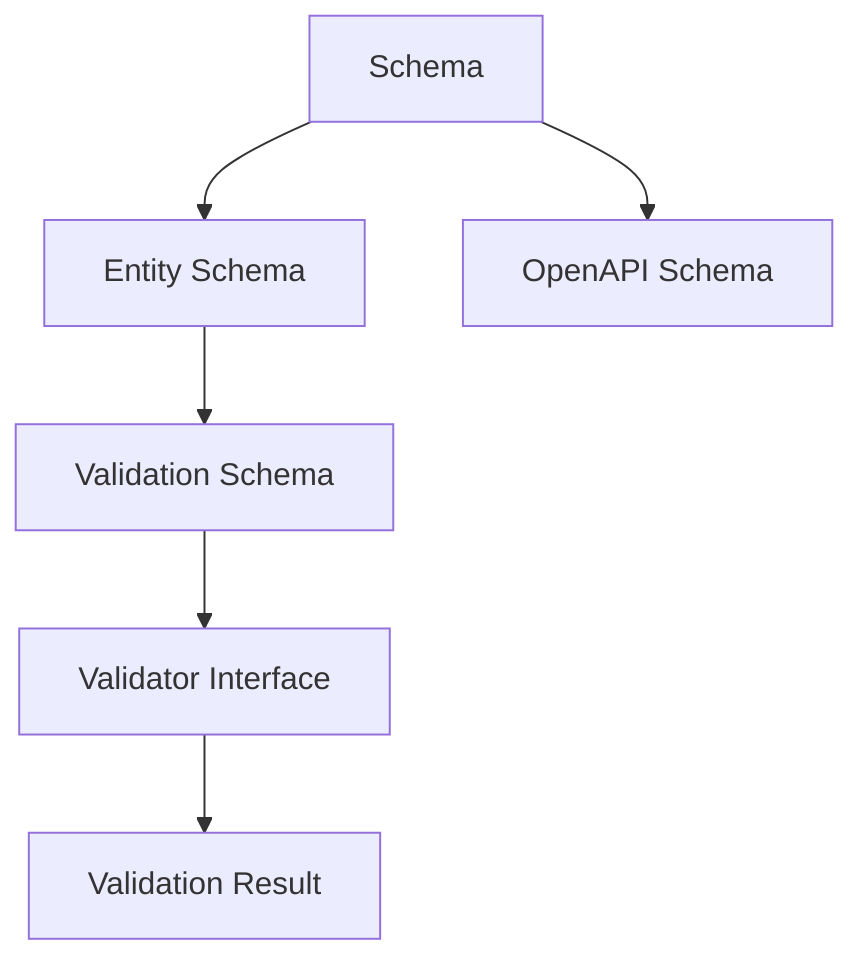

**Key Components:**
- `Schema<T>` - Base schema type
- `entity()` - Creates schema from Metal-ORM entity
- `Validator` interface - Validation contract
- `ValidationResult<T>` - Validation result type
- `ValidationIssue` - Individual validation issues

**Usage Flow:**
```typescript
// 1. Create schema from entity
const userSchema = entity(User, {
  omit: ['passwordHash']
});

// 2. Validate data
const validationResult = await validator.validate(userData, userSchema);

// 3. Handle validation result
if (!validationResult.ok) {
  throw ValidationError.fromIssues(validationResult.issues);
}

// 4. Use validated data
const validatedUser = validationResult.value;
```

### Validation Integration Points

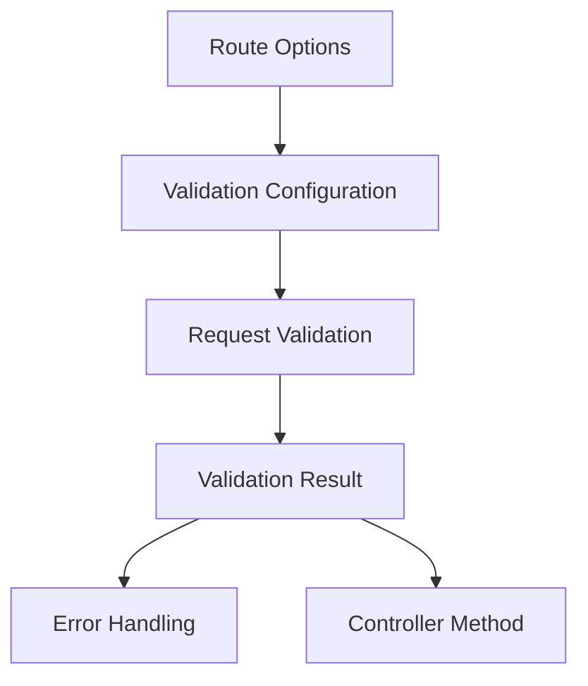

**Integration Example:**
```typescript
// 1. Define validation in route options
@Post('/users', {
  validate: {
    body: Schema.Object({
      name: Schema.String().minLength(3),
      email: Schema.String().format('email')
    })
  }
})

// 2. Validation is automatically performed
async createUser(@Body() userData: CreateUserDto) {
  // userData is already validated at this point
  return await userService.create(userData);
}

// 3. Validation errors are automatically handled
// If validation fails, ValidationError is thrown automatically
```

## OpenAPI and Documentation Relationships

### OpenAPI Generation Flow

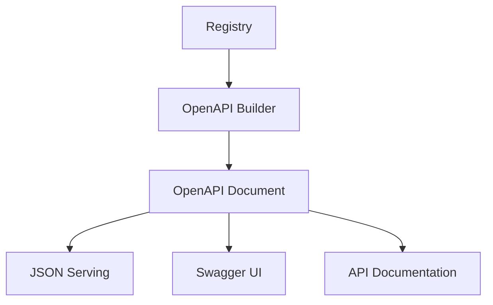

**Key Components:**
- `Registry` - Route and controller metadata
- `buildOpenApi()` - Generates OpenAPI document
- `OpenApiBuildOptions` - Configuration options
- `OpenApiDocument` - Generated OpenAPI specification
- `serveOpenApi()` - Serves OpenAPI JSON

**Usage Flow:**
```typescript
// 1. Build registry
const registry = buildRegistry([UserController, ProductController]);

// 2. Generate OpenAPI document
const openApiDoc = buildOpenApi(registry, {
  title: 'My API',
  version: '1.0.0',
  servers: [
    { url: 'https://api.example.com/v1' }
  ]
});

// 3. Serve OpenAPI JSON
app.use('/openapi.json', (req, res) => {
  res.json(openApiDoc);
});

// 4. Serve Swagger UI
app.use('/docs', serveOpenApi(registry, openApiOptions));
```

### Documentation Source Relationships

```mermaid
graph TD
    A[Route Decorators] --> B[Route Options]
    B --> C[OpenAPI Metadata]
    A -->|@Tags| C
    A -->|@OperationId| C
    A -->|@Deprecated| C
    B -->|summary| C
    B -->|description| C
    B -->|responses| C
```

**Documentation Sources:**
- Decorator metadata (`@Tags`, `@OperationId`, `@Deprecated`)
- Route options (`summary`, `description`, `responses`)
- Parameter validation schemas
- Security requirements
- Response specifications

**Example:**
```typescript
@Controller('/users', {
  tags: ['Users'], // OpenAPI tags
  description: 'User management endpoints'
})
class UserController {
  @Get('/:id')
  @OperationId('getUserById') // OpenAPI operationId
  @Tags('Users') // Additional tags
  @Responses({
    200: { description: 'User found' }, // OpenAPI response
    404: { description: 'User not found' }
  })
  async getUser(id: string) {}
}
```

## Integration API Relationships

### Metal-ORM Integration Flow

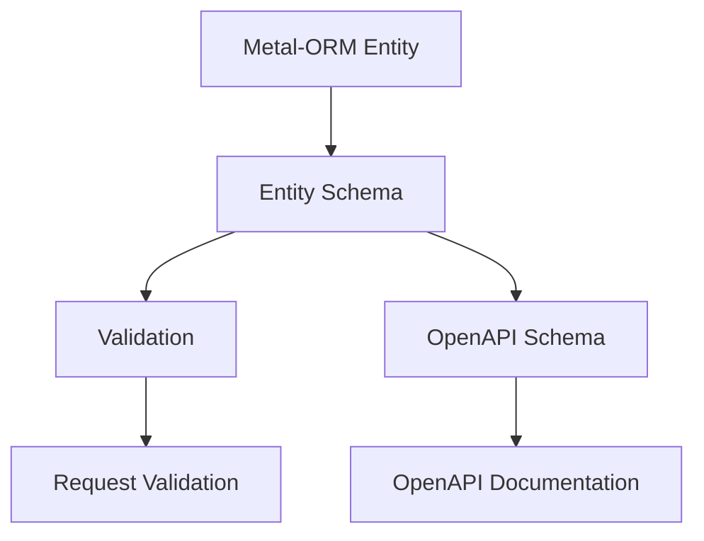

**Key Components:**
- `EntityCtor<T>` - Metal-ORM entity constructor
- `entity()` - Creates schema from entity
- `EntitySchemaOptions` - Schema customization
- `Validator` interface - Validation contract

**Integration Example:**
```typescript
// 1. Define Metal-ORM entity
@Entity()
class User {
  @PrimaryKey()
  id: string;

  @Column()
  name: string;

  @Column()
  email: string;
}

// 2. Create schema from entity
const userSchema = entity(User, {
  omit: ['passwordHash'] // Exclude sensitive fields
});

// 3. Use schema for validation
@Post('/users', {
  validate: {
    body: userSchema
  }
})
async createUser(@Body() userData: CreateUserDto) {
  // userData is validated against User entity structure
  return await userService.create(userData);
}

// 4. Schema is also used for OpenAPI documentation
// The OpenAPI spec will include the User schema structure
```

### Express Integration Flow

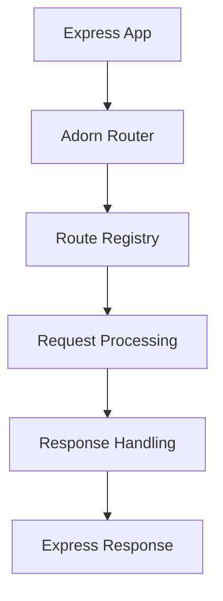

**Key Components:**
- `createAdornExpressApp()` - Creates complete Express app
- `createAdornExpressRouter()` - Creates Express router
- `applyRegistryToExpressRouter()` - Applies routes
- `adornErrorHandler` - Error handling
- `RequestContext` - Request context

**Integration Example:**
```typescript
// 1. Create Express app with Adorn
const app = createAdornExpressApp({
  controllers: [UserController, ProductController],
  openapi: {
    title: 'My API',
    version: '1.0.0'
  },
  errorHandler: {
    onError: (err, ctx) => {
      // Custom error handling
      return ctx.defaultProblem;
    }
  }
});

// 2. Start server
app.listen(3000, () => {
  console.log('Server running on port 3000');
});

// 3. Routes are automatically registered
// 4. OpenAPI documentation is automatically generated
// 5. Error handling is automatically configured
```

## Summary

This document provides comprehensive cross-references between the various components of Adorn API, showing how they work together to create a cohesive framework. Understanding these relationships helps developers:

1. **Navigate the codebase** more effectively
2. **Understand component interactions** and dependencies
3. **Design better integrations** with the framework
4. **Debug issues** by following the data flow
5. **Extend the framework** with new features

The relationships shown here demonstrate the well-designed architecture of Adorn API, where components are loosely coupled but work together seamlessly to provide a powerful API development experience.