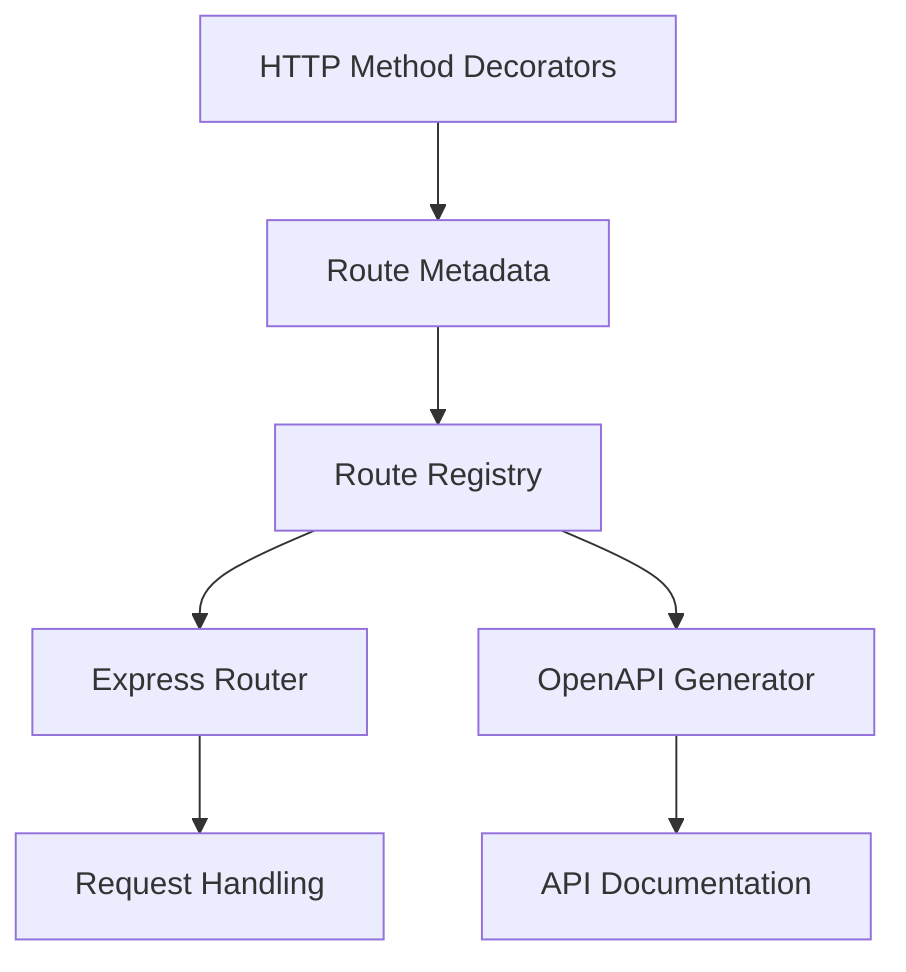
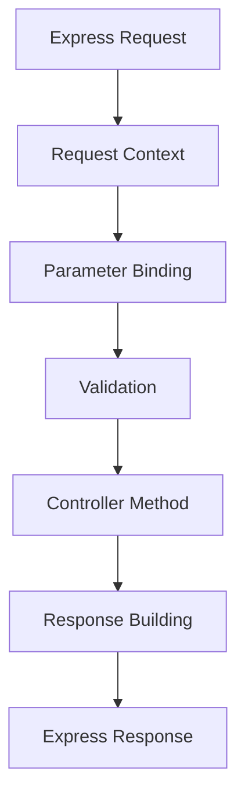

# Core API Relationships

This document covers the fundamental relationships between core Adorn API components, including route definition, registration, and the request processing pipeline.

## Route Definition and Registration



### Key Components

- [`@Get()`](../controller-decorators.md), [`@Post()`](../controller-decorators.md), [`@Put()`](../controller-decorators.md), [`@Patch()`](../controller-decorators.md), [`@Delete()`](../controller-decorators.md) - Define routes on controller methods
- [`RouteMeta`](../api-reference.md#routemeta) - Stores route metadata (method, path, options)
- [`RouteEntry`](../api-reference.md#routeentry) - Complete route information in registry
- [`Registry`](../api-reference.md#registry) - Central collection of all routes and controllers
- [`buildRegistry()`](../api-reference.md#buildregistry) - Creates registry from controllers
- [`applyRegistryToExpressRouter()`](../api-reference.md#applyregistrytoexpressrouter) - Applies routes to Express
- [`buildOpenApi()`](../openapi-generator.md#buildopenapi) - Generates OpenAPI from registry

### Usage Flow

```typescript
// 1. Define routes with decorators
@Controller('/users')
class UserController {
  @Get('/:id')
  async getUser(id: string) {}
}

// 2. Build registry
const registry = buildRegistry([UserController]);

// 3. Use registry for Express
const router = express.Router();
applyRegistryToExpressRouter(router, registry);

// 4. Use registry for OpenAPI
const openApiDoc = buildOpenApi(registry, { title: 'My API', version: '1.0.0' });
```

## Request Processing Pipeline



### Key Components

- [`RequestContext`](../api-reference.md#requestcontext) - Contains request data and context
- [`bindArgs()`](../api-reference.md#bindargs) - Binds parameters to handler arguments
- [`Validator`](../api-reference.md#validator) interface - Validates request data
- Controller methods - Business logic
- [`reply()`](../response-building-patterns.md#reply), [`noContent()`](../response-building-patterns.md#nocontent) - Build responses
- [`Reply`](../api-reference.md#reply) type - Typed response objects

### Usage Flow

```typescript
// 1. Request comes in
app.use('/api', router);

// 2. Parameter binding
const { args } = bindArgs(route, handler, requestContext);

// 3. Validation
const validationResult = await validator.validate(args);

// 4. Controller execution
const result = await handler(...args);

// 5. Response building
if (isReply(result)) {
  res.status(result.status).json(result.body);
}