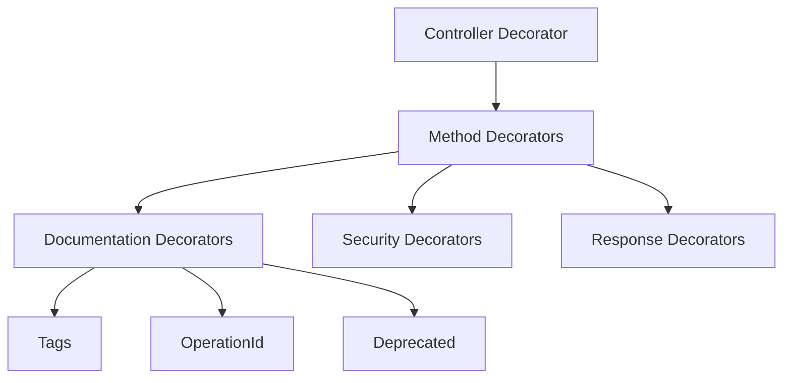
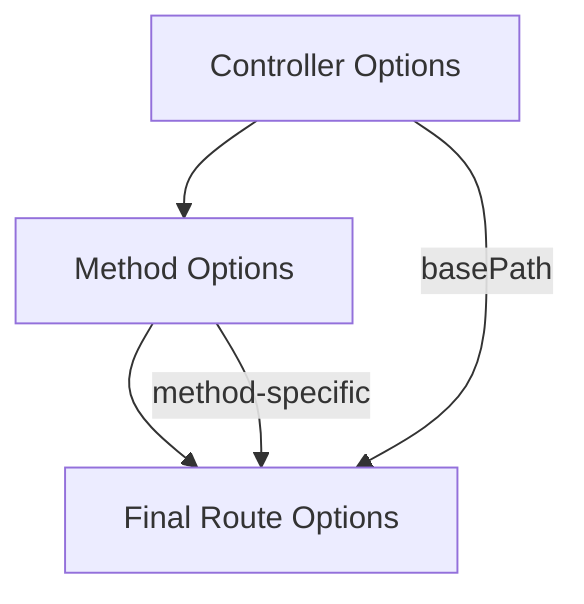

# Decorator and Route Relationships

This document covers the relationships between decorators and routes, including the decorator hierarchy and route configuration inheritance.

## Decorator Hierarchy



### Key Relationships

- [`@Controller()`](../controller-decorators.md#controller) - Defines controller class with base path
- [`@Get()`](../controller-decorators.md#get), [`@Post()`](../controller-decorators.md#post), etc. - Define routes on methods
- [`@Tags()`](../stage-3-decorators.md#tags) - Adds OpenAPI tags to routes
- [`@OperationId()`](../stage-3-decorators.md#operationid) - Sets unique operation ID
- [`@Deprecated()`](../stage-3-decorators.md#deprecated) - Marks route as deprecated
- [`@Responses()`](../stage-3-decorators.md#responses) - Defines response specifications
- [`@Security()`](../stage-3-decorators.md#security) - Sets security requirements

### Example

```typescript
@Controller('/users', {
  security: [{ bearerAuth: [] }]
})
@Tags('Users', 'API')
class UserController {
  @Get('/:id')
  @OperationId('getUserById')
  @Responses({
    200: { description: 'User found' },
    404: { description: 'User not found' }
  })
  async getUser(id: string) {}
}
```

## Route Configuration Inheritance



### Inheritance Rules

1. Controller `basePath` prefixes all route paths
2. Controller-level options apply to all methods
3. Method-level options override controller options
4. Decorator options merge with method options

### Example

```typescript
@Controller('/api/v1/users', {
  security: [{ bearerAuth: [] }],
  tags: ['Users']
})
class UserController {
  // Inherits security and tags from controller
  @Get('/:id', {
    summary: 'Get user by ID' // Adds to inherited options
  })
  async getUser(id: string) {}
}