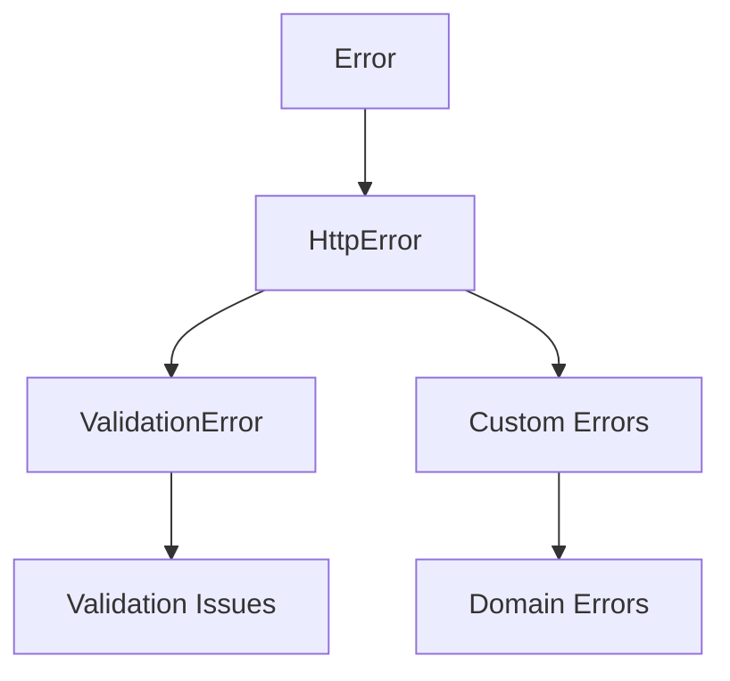
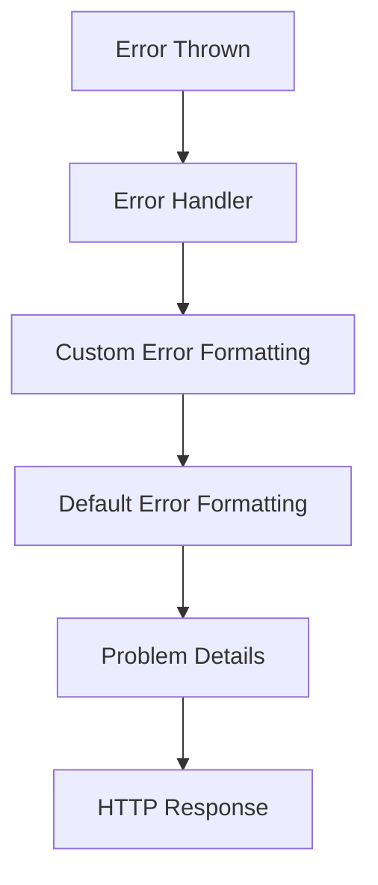

# Error Handling Relationships

This document covers the relationships between error types, error handling flow, and error formatting in Adorn API.

## Error Type Hierarchy



### Key Components

- [`Error`](../api-reference.md#error) - Base JavaScript error
- [`HttpError`](../api-reference.md#httperror) - HTTP error with status code
- [`ValidationError`](../api-reference.md#validationerror) - Validation-specific error
- Custom errors - Domain-specific errors

### Usage Patterns

```typescript
// Basic HttpError
throw new HttpError(404, 'User not found', {
  code: 'USER_NOT_FOUND',
  details: { id: '123' }
});

// ValidationError
throw ValidationError.fromIssues([
  { path: ['body', 'email'], message: 'Invalid email format' }
]);

// Custom domain error
class UserNotFoundError extends HttpError {
  constructor(userId: string) {
    super(404, 'User not found', {
      code: 'USER_NOT_FOUND',
      details: { userId }
    });
  }
}
```

## Error Handling Flow



### Key Components

- [`adornErrorHandler`](../api-reference.md#adornerrorhandler) - Default error handler
- [`createAdornExpressErrorHandler`](../api-reference.md#createadornexpresserrorhandler) - Customizable handler
- [`AdornErrorHandlerOptions`](../api-reference.md#adornerrorhandleroptions) - Customization options
- [`toProblemDetails()`](../api-reference.md#toproblemdetails) - Converts errors to Problem Details
- [`ProblemDetails`](../api-reference.md#problemdetails) - RFC 7807 problem details format

### Usage Flow

```typescript
// 1. Configure error handler
const errorHandler = createAdornExpressErrorHandler({
  onError: (err, ctx) => {
    // Custom error formatting
    if (err instanceof ValidationError) {
      return {
        status: 400,
        body: {
          success: false,
          errors: err.issues
        }
      };
    }
    return ctx.defaultProblem; // Use default for other errors
  }
});

// 2. Use error handler
app.use(errorHandler);

// 3. Errors are automatically handled
throw new HttpError(404, 'User not found'); // -> 404 response