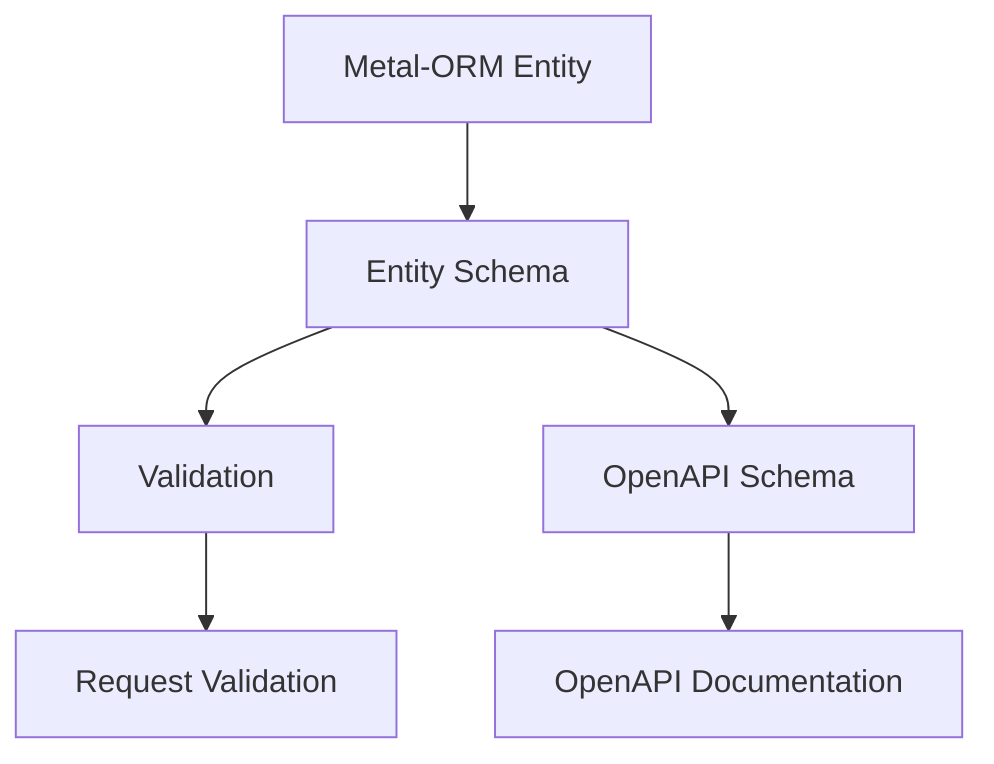
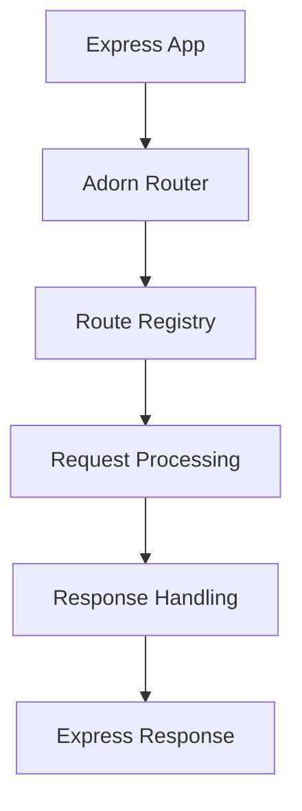

# Integration API Relationships

This document covers the relationships between Adorn API and external integrations, particularly Metal-ORM and Express.

## Metal-ORM Integration Flow



### Key Components

- [`EntityCtor<T>`](../metal-orm-integration.md#entityctor) - Metal-ORM entity constructor
- [`entity()`](../metal-orm-integration.md#entity) - Creates schema from entity
- [`EntitySchemaOptions`](../metal-orm-integration.md#entityschemaoptions) - Schema customization
- [`Validator`](../api-reference.md#validator) interface - Validation contract

### Integration Example

```typescript
// 1. Define Metal-ORM entity
@Entity()
class User {
  @PrimaryKey()
  id: string;

  @Column()
  name: string;

  @Column()
  email: string;
}

// 2. Create schema from entity
const userSchema = entity(User, {
  omit: ['passwordHash'] // Exclude sensitive fields
});

// 3. Use schema for validation
@Post('/users', {
  validate: {
    body: userSchema
  }
})
async createUser(userData: CreateUserDto) {
  // userData is validated against User entity structure
  return await userService.create(userData);
}

// 4. Schema is also used for OpenAPI documentation
// The OpenAPI spec will include the User schema structure
```

## Express Integration Flow



### Key Components

- [`createAdornExpressApp()`](../api-reference.md#createadornexpressapp) - Creates complete Express app
- [`createAdornExpressRouter()`](../api-reference.md#createadornexpressrouter) - Creates Express router
- [`applyRegistryToExpressRouter()`](../api-reference.md#applyregistrytoexpressrouter) - Applies routes
- [`adornErrorHandler`](../api-reference.md#adornerrorhandler) - Error handling
- [`RequestContext`](../api-reference.md#requestcontext) - Request context

### Integration Example

```typescript
// 1. Create Express app with Adorn
const app = createAdornExpressApp({
  controllers: [UserController, ProductController],
  openapi: {
    title: 'My API',
    version: '1.0.0'
  },
  errorHandler: {
    onError: (err, ctx) => {
      // Custom error handling
      return ctx.defaultProblem;
    }
  }
});

// 2. Start server
app.listen(3000, () => {
  console.log('Server running on port 3000');
});

// 3. Routes are automatically registered
// 4. OpenAPI documentation is automatically generated
// 5. Error handling is automatically configured