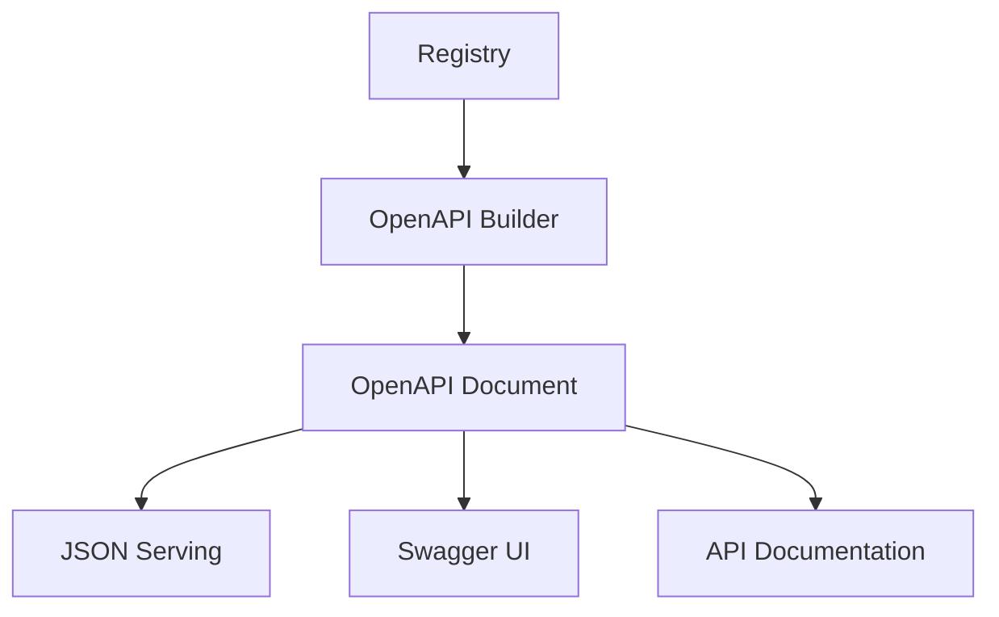

# OpenAPI and Documentation Relationships

This document covers the relationships between OpenAPI generation, documentation sources, and the overall documentation flow in Adorn API.

## OpenAPI Generation Flow



### Key Components

- [`Registry`](../api-reference.md#registry) - Route and controller metadata
- [`buildOpenApi()`](../openapi-generator.md#buildopenapi) - Generates OpenAPI document
- [`OpenApiBuildOptions`](../openapi-generator.md#openapibuildoptions) - Configuration options
- [`OpenApiDocument`](../openapi-generator.md#openapidocument) - Generated OpenAPI specification
- [`serveOpenApi()`](../openapi-generator.md#serveopenapi) - Serves OpenAPI JSON

### Usage Flow

```typescript
// 1. Build registry
const registry = buildRegistry([UserController, ProductController]);

// 2. Generate OpenAPI document
const openApiDoc = buildOpenApi(registry, {
  title: 'My API',
  version: '1.0.0',
  servers: [
    { url: 'https://api.example.com/v1' }
  ]
});

// 3. Serve OpenAPI JSON
app.use('/openapi.json', (req, res) => {
  res.json(openApiDoc);
});

// 4. Serve Swagger UI
app.use('/docs', serveOpenApi(registry, openApiOptions));
```

## Documentation Source Relationships

```mermaid
graph TD
    A[Route Decorators] --> B[Route Options]
    B --> C[OpenAPI Metadata]
    A -->|@Tags| C
    A -->|@OperationId| C
    A -->|@Deprecated| C
    B -->|summary| C
    B -->|description| C
    B -->|responses| C
```

### Documentation Sources

- Decorator metadata ([`@Tags`](../stage-3-decorators.md#tags), [`@OperationId`](../stage-3-decorators.md#operationid), [`@Deprecated`](../stage-3-decorators.md#deprecated))
- Route options ([`summary`](../api-reference.md#routeoptions), [`description`](../api-reference.md#routeoptions), [`responses`](../api-reference.md#routeoptions))
- Parameter validation schemas
- Security requirements
- Response specifications

### Example

```typescript
@Controller('/users', {
  tags: ['Users'], // OpenAPI tags
  description: 'User management endpoints'
})
class UserController {
  @Get('/:id')
  @OperationId('getUserById') // OpenAPI operationId
  @Tags('Users') // Additional tags
  @Responses({
    200: { description: 'User found' }, // OpenAPI response
    404: { description: 'User not found' }
  })
  async getUser(id: string) {}
}