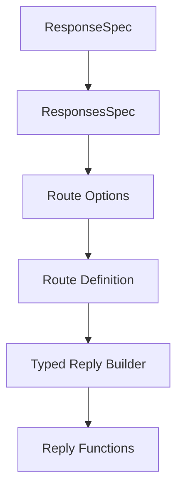

# Response and Reply Relationships

This document covers the relationships between response types, reply builders, and response building patterns in Adorn API.

## Response Type Hierarchy



### Key Components

- [`ResponseSpec`](../api-reference.md#responsespec) - Single response specification
- [`ResponsesSpec`](../api-reference.md#responsesspec) - Collection of responses by status code
- [`RouteOptions`](../api-reference.md#routeoptions) - Contains responses configuration
- [`defineRoute()`](../api-reference.md#defineroute) - Creates route with responses
- [`makeReply()`](../response-building-patterns.md#makereply) - Creates typed reply builder
- [`reply()`](../response-building-patterns.md#reply), [`noContent()`](../response-building-patterns.md#nocontent) - Response functions

### Usage Flow

```typescript
// 1. Define responses
const userRoute = defineRoute('/users/:id', {
  responses: {
    200: { description: 'User found', content: { 'application/json': { schema: userSchema } } },
    404: { description: 'User not found' }
  }
});

// 2. Get typed reply builder
const reply = userRoute.reply;

// 3. Use typed responses
reply(200, user); // Type-safe!
reply(404, { error: 'Not found' }); // Type-safe!
```

## Response Building Patterns

```mermaid
graph TD
    A[Basic Reply] --> B[Typed Reply]
    B --> C[Route-Specific Reply]
    A -->|reply()| D[Reply Object]
    B -->|makeReply()| E[Typed Reply Builder]
    C -->|route.reply()| F[Route-Specific Reply]
```

### Pattern Comparison

```typescript
// Basic reply (untyped)
return reply(200, user);

// Typed reply (schema-based)
const typedReply = makeReply({
  200: { content: { 'application/json': { schema: userSchema } } }
});
typedReply.reply(200, user); // Type-safe!

// Route-specific reply (most type-safe)
const userRoute = defineRoute('/users/:id', {
  responses: {
    200: { content: { 'application/json': { schema: userSchema } } },
    404: { content: { 'application/json': { schema: errorSchema } } }
  }
});
userRoute.reply(200, user); // Most type-safe!
userRoute.reply(404, { error: 'Not found' }); // Most type-safe!