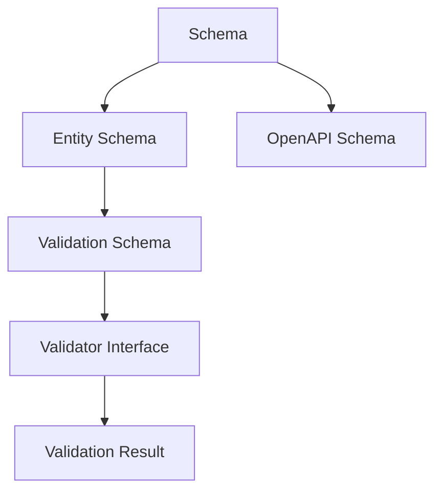
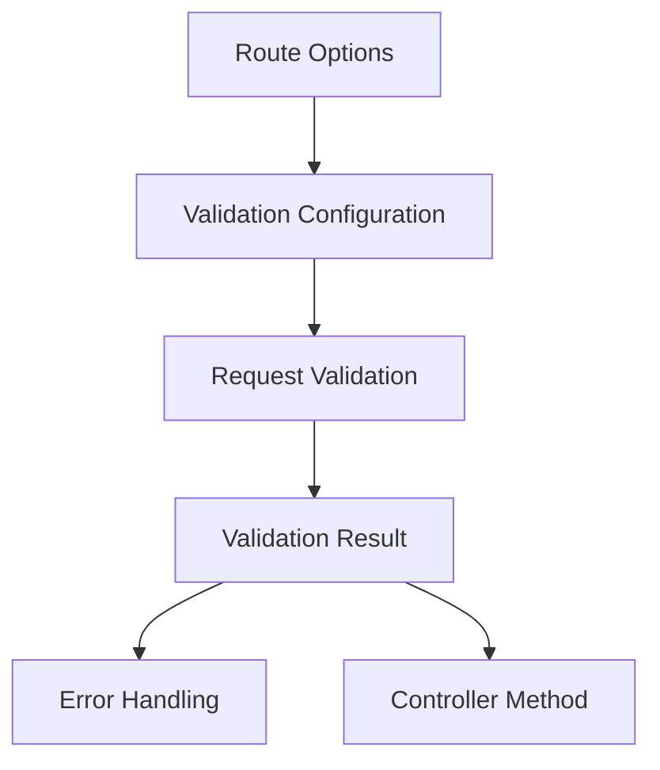

# Validation and Schema Relationships

This document covers the relationships between validation schemas, schema types, and validation integration points in Adorn API.

## Schema Type Hierarchy



### Key Components

- [`Schema<T>`](../api-reference.md#schema) - Base schema type
- [`entity()`](../metal-orm-integration.md#entity) - Creates schema from Metal-ORM entity
- [`Validator`](../api-reference.md#validator) interface - Validation contract
- [`ValidationResult<T>`](../api-reference.md#validationresult) - Validation result type
- [`ValidationIssue`](../api-reference.md#validationissue) - Individual validation issues

### Usage Flow

```typescript
// 1. Create schema from entity
const userSchema = entity(User, {
  omit: ['passwordHash']
});

// 2. Validate data
const validationResult = await validator.validate(userData, userSchema);

// 3. Handle validation result
if (!validationResult.ok) {
  throw ValidationError.fromIssues(validationResult.issues);
}

// 4. Use validated data
const validatedUser = validationResult.value;
```

## Validation Integration Points



### Integration Example

```typescript
// 1. Define validation in route options
@Post('/users', {
  validate: {
    body: Schema.Object({
      name: Schema.String().minLength(3),
      email: Schema.String().format('email')
    })
  }
})

// 2. Validation is automatically performed
async createUser(userData: CreateUserDto) {
  // userData is already validated at this point
  return await userService.create(userData);
}

// 3. Validation errors are automatically handled
// If validation fails, ValidationError is thrown automatically