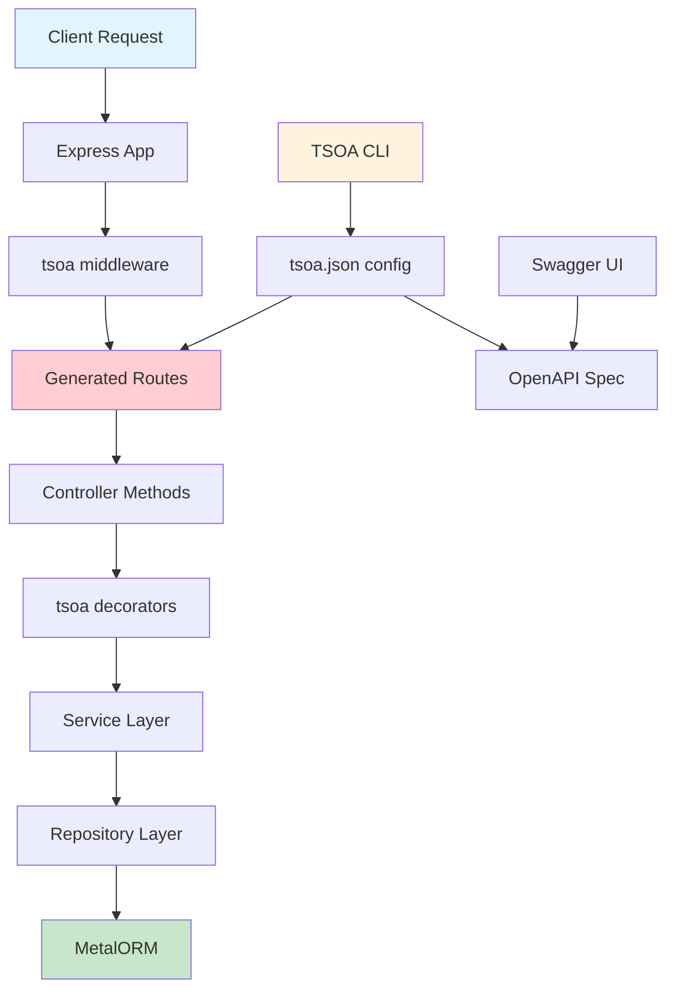
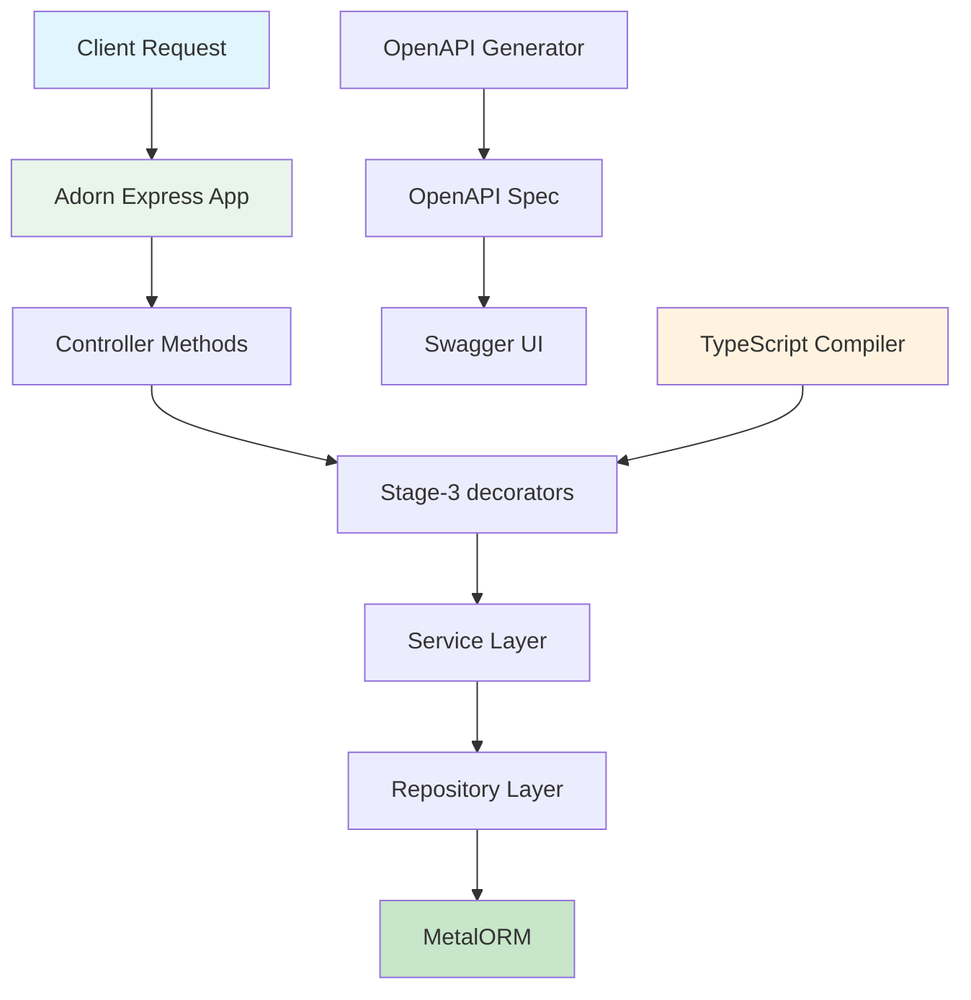
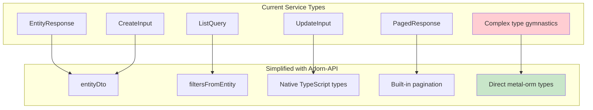
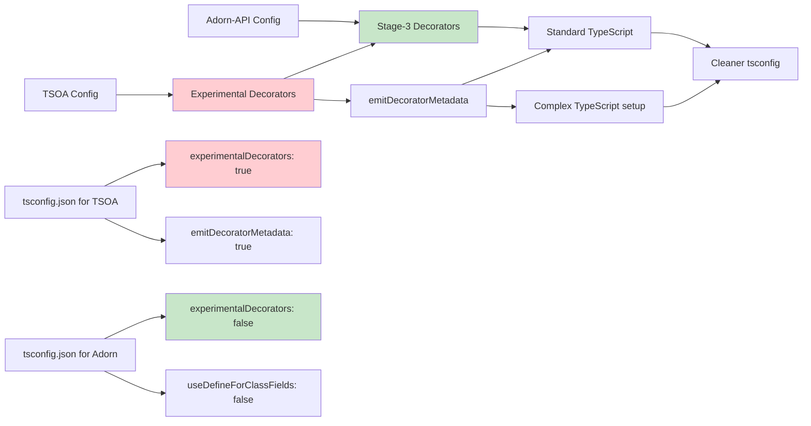
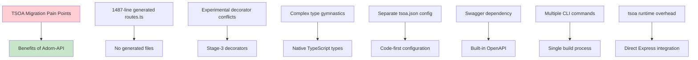

# TSOA to Adorn-API Migration Architecture Diagrams

## Current TSOA Architecture



## Target Adorn-API Architecture



## Migration Flow

```mermaid
graph LR
    A[TSOA Setup] --> B[Dependency Update]
    B --> C[TypeScript Config]
    C --> D[App Factory Migration]
    D --> E[Controller Migration]
    E --> F[Service Layer Update]
    F --> G[Cleanup TSOA Artifacts]
    G --> H[Testing & Validation]
    
    A1[tsoa.json] --> A2[package.json]
    A1 --> A3[tsconfig.json]
    A2 --> B
    A3 --> C
    
    D1[RegisterRoutes] --> D2[createAdornExpressApp]
    
    E1[@Controller, @Get, etc.] --> E2[Same decorators]
    E1 --> F1[service-types.ts]
    F1 --> F2[Simplified types]
    
    G1[Generated routes.ts] --> G2[Delete file]
    G1 --> G3[Remove tsoa scripts]
    
    style A fill:#ffcdd2
    style H fill:#c8e6c9
    style B fill:#fff3e0
```

## Controller Comparison

```mermaid
graph TB
    subgraph TSOA ["TSOA Controller"]
        A1[@Route('especializada')]
        A2[@Tags('Especializada')]
        A3[@Get()]
        A4[@Post()]
        A5[@Get('{id}')]
        A6[@Body()]
        A7[@Query()]
        A8[@Path()]
        A9[@Response(404, 'Not Found')]
        A10[@SuccessResponse(201, 'Created')]
        
        A3 --> A7
        A4 --> A6
        A5 --> A8
        A4 --> A10
        A5 --> A9
    end
    
    subgraph AdornAPI ["Adorn-API Controller"]
        B1[@Controller('/api/especializada')]
        B2[@Tags(['Especializada'])]
        B3[@Get('/')]
        B4[@Post('/')]
        B5[@Get('/{id}')]
        B6[@entityDto()]
        B7[@Bindings({ path: { id: 'int' } })]
        B8[@Response({ status: 404, description: 'Not Found' })]
        
        B3 --> B7
        B4 --> B6
        B5 --> B7
        B3 --> B8
    end
    
    style A1 fill:#ffcdd2
    style B1 fill:#c8e6c9
```

## Service Layer Simplification



## TypeScript Configuration Changes



## File Structure Comparison

```mermaid
graph TB
    subgraph Current ["Current File Structure"]
        A[src/]
        A1[controllers/]
        A1 --> A2[EspecializadaController.ts]
        A1 --> A3[ItemAjudaController.ts]
        A1 --> A4[NotaVersaoController.ts]
        A1 --> A5[OrmController.ts]
        
        A6[routes/]
        A6 --> A7[routes.ts] # 1487 lines!
        
        A8[services/]
        A8 --> A9[service-types.ts] # Complex types
        
        B[tsoa.json]
        C[scripts/fix-tsoa-routes.mjs]
    end
    
    subgraph Target ["Target File Structure"]
        D[src/]
        D1[controllers/]
        D1 --> D2[EspecializadaController.ts] # Clean decorators
        D1 --> D3[ItemAjudaController.ts]
        D1 --> D4[NotaVersaoController.ts]
        D1 --> D5[adorn-controller.ts] # Simple base
        
        D6[services/] 
        D6 --> D7[simplified-services.ts] # Less complex
        
        E[No generated files!]
        F[No tsoa.json]
        G[No route generation scripts]
    end
    
    A7 --> E
    B --> F
    C --> G
    
    style A7 fill:#ffcdd2
    style B fill:#ffcdd2
    style C fill:#ffcdd2
    style E fill:#c8e6c9
    style F fill:#c8e6c9
    style G fill:#c8e6c9
```

## Migration Benefits Summary



## Error Handling Comparison

```mermaid
graph TB
    subgraph TSOA ["TSOA Error Handling"]
        A1[Controller.setStatus(201)]
        A2[@Response(404, 'Not Found')]
        A3[@SuccessResponse(201, 'Created')]
        A4[Manual status code management]
    end
    
    subgraph AdornAPI ["Adorn-API Error Handling"]
        B1[Automatic 201 for POST]
        B2[@Response({ status: 404, description: 'Not Found' })]
        B3[Built-in error mapping]
        B4[Problem Details format]
    end
    
    A1 --> B1
    A2 --> B2
    A3 --> B3
    A4 --> B4
    
    style A1 fill:#ffcdd2
    style B1 fill:#c8e6c9
```

These diagrams illustrate the key architectural differences and migration benefits between the current tsoa implementation and the target adorn-api architecture. The migration will result in a cleaner, more maintainable codebase with better integration with metal-orm.